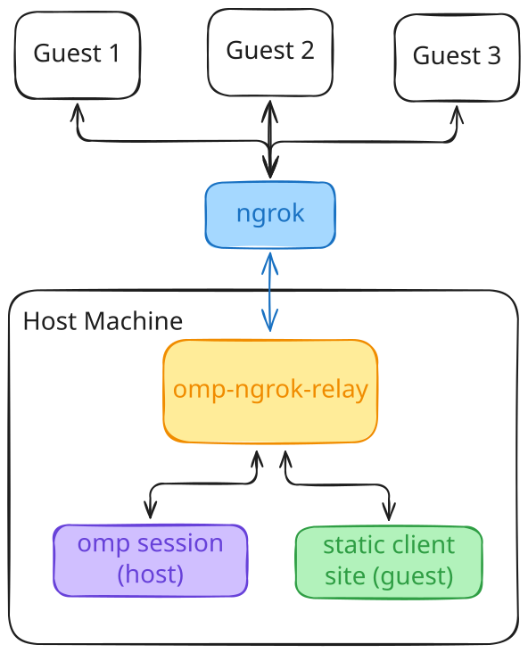

# omp-ngrok-relay



Self-hostable relay for [omp](https://github.com/can1357/oh-my-pi) `/collab` sessions. Share your agent session
with others.

## How it works

Start the relay, launch a new omp agent session, and paste in the `/collab` link from the relay's
logs. Save the room token from the `/collab` output and give it to others, along with the URL
to the ngrok endpoint in front of the relay. They'll be able to join your omp session from their
browser.

omp ships with a public relay at `wss://my.omp.sh`. This project is the same thing, it's just run
by you on your own machine and protected with ngrok.

## Quick start

```sh
nix build .#relay
export NGROK_AUTHTOKEN=...      # or --authtoken-file
./bin/omp-ngrok-relay --oauth-allow you@gmail.com
```

Or without cloning anything:

```sh
NGROK_AUTHTOKEN=... nix run github:learnitall/omp-ngrok-relay -- --oauth-allow you@gmail.com
```

Either way it prints both doors:

```
omp-ngrok-relay 0.1.0 listening on ws://127.0.0.1:7466 (22 embedded client files)
  hosting bind:  ws://127.0.0.1:7466
     omp config set collab.relayUrl ws://127.0.0.1:7466
     or one-shot, no config:  /collab ws://127.0.0.1:7466
  tunnel origin (guests only):  ws://127.0.0.1:59663
ngrok endpoint: https://<temp>.ngrok-free.app
  browser guests:  https://<temp>.ngrok-free.app  (sign in with google)
  hosting through the tunnel is refused; hosts use the hosting bind.
  terminal guests (`omp join`) cannot authenticate and will be rejected.
```

- omp host command: `/collab ws://127.0.0.1:7466`
- guest URL: `https://<temp>.ngrok-free.app`

In a new omp session type the `/collab` command from the relay output. You'll get something like this:

```
Collab session started!
 Join from another terminal: omp join
"ws://127.0.0.1:7466/r/<token>"
 or any web browser:
127.0.0.1:7466/#ws://127.0.0.1:7466/r/<token>
Anyone with the link can read the session and prompt the agent. Read-only link: /collab view
```

The bit after the `/r/` in the URLs is the room token.

Send your guests the ngrok endpoint URL from the relay logs (in this example `https://<temp>.ngrok-free.app`)
and they'll get a page that has a `JOIN LINK` text box. Inside, ask them to enter the following:

```
wss://<endpoint url>/r/<token>
```

In this example, it would be:

```
wss://<temp>.ngrok-free.app/r/<token>
```

To give them a one-click URL, use the following format:

```
https://<endpoint url>/#wss://<endpoint url>/r/<token>
```

> Unfortunately the output from the `/collab` session is hardcoded to use whatever address the host agent
> connected via, so we have to manually construct a join link for guests.

## Hosts vs Guests

**Opening a room is gated by reachability**. Use CLI args to control where the relay listens for
requests to host a new room.

The relay binds two listeners on the local machine:

| listener      | address                                       | accepts                            |
| ------------- | --------------------------------------------- | ---------------------------------- |
| hosting bind  | `--hostname:--port`, default `127.0.0.1:7466` | everything                         |
| tunnel origin | ephemeral loopback, not configurable          | everything except host connections |

So **`--hostname` is the hosting ACL.** The default keeps hosting to the relay's own machine.
Widening it deliberately widens hosting, which is how you host from outside a container:

```sh
# in the container: accept hosts from the container network
docker run -p 127.0.0.1:7466:7466 -e NGROK_AUTHTOKEN \
  omp-ngrok-relay:0.1.0 --hostname 0.0.0.0 --oauth-allow you@gmail.com

# on the docker host: omp hosts through the published port
omp config set collab.relayUrl ws://127.0.0.1:7466
```

**Joining a room is gated by OAuth.** The compiled-in traffic policy
([`policy.ts`](./policy.ts)) puts an ngrok `oauth` action in front of the public endpoint that
denies any identity outside `--oauth-allow` with a 403.

The upstream browser client from [`packages/collab-web`](https://github.com/can1357/oh-my-pi/tree/main/packages/collab-web)
is packaged into the relay for guests to use when they connect. It's a set of static assets that are
served by the relay through the ngrok endpoint. The relay takes care of hooking guests into the
host agent's session.

This setup means that terminal guests no longer work. `omp join` isn't compatible with OAuth. That is
the deliberate trade, authenticated browser guests instead of anonymous terminal ones.

An open relay also risks plain abuse, since anyone who learns the hostname can open rooms and push
bytes through it, so the ngrok traffic policy caps handshakes per client IP and 404s any path outside
those used by the relay.

## Options

```
--port <n>            port of the hosting bind (default 7466)
--hostname <host>     address of the hosting bind (default 127.0.0.1); whoever can
                      reach it can host, so 0.0.0.0 opens hosting to that network
--max-guests <n>      per-room guest cap, 0 = unlimited (default 0)
--ngrok-url <url>     reserved ngrok URL, e.g. https://collab.example.com
--oauth-provider <p>  ngrok OAuth provider for browser guests (default google)
--oauth-allow <who>   permitted identity, repeatable or comma-separated:
                      user@example.com for one address, @example.com for a domain
--authtoken-file <p>  file holding the ngrok authtoken; wins over NGROK_AUTHTOKEN
--version, --help
```

An ngrok authtoken is required, from `NGROK_AUTHTOKEN` or `--authtoken-file`. At least one `--oauth-allow` is
required too. Token, allowlist and policy are all resolved before

The `@` on a domain passed to `--oauth-allow` can be used to allow any user from the domain:
`@example.com` compiles to `endsWith('@example.com')`

## Credits

The protocol, the reference implementation this follows
([`scripts/local-relay.ts`](https://github.com/can1357/oh-my-pi/blob/main/packages/collab-web/scripts/local-relay.ts)),
and the web client are all from [can1357/oh-my-pi](https://github.com/can1357/oh-my-pi).

MIT.
